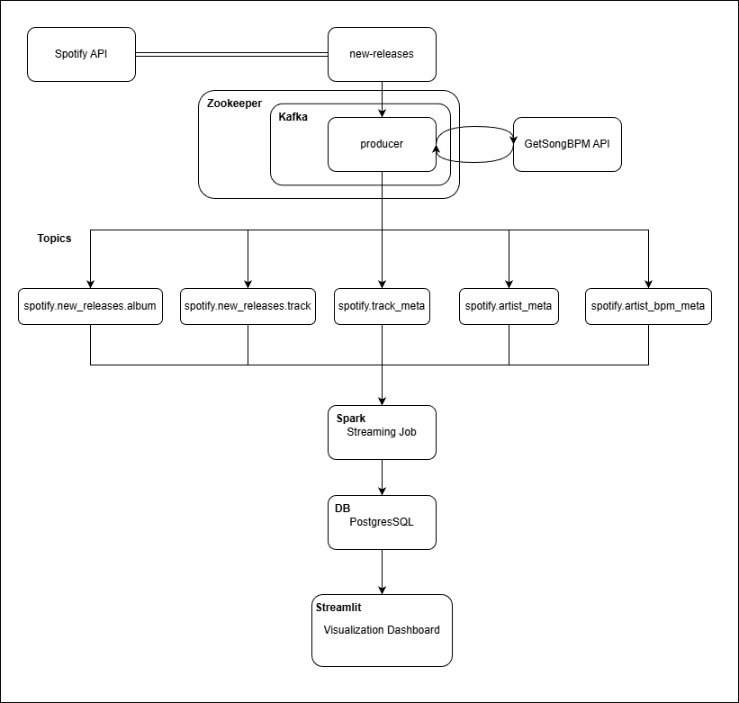

# Data Engineering – Master AI Engineering
 
**Authors:**  
- Alexander Mosor  
- Felix Flasch  
- Mirza Zenkic  
- Mohammed Laktaoui  

---

## Basic Structure

### Project Requirements

The project requirements were as follows:

- Store and/or read and/or process the data using a database (relational, NoSQL, or both).  
- Use Spark and/or Kafka to create data streams.  
- Showcase your results with Streamlit.

---

### Overview

To fulfill these requirements, we chose the **Spotify API** as our data source, since it provides interesting opportunities to visualize and analyze music data. However, we quickly realized that many of Spotify’s older endpoints had been deprecated, leaving only a few suitable ones for our use case.

We decided to use the **`/v1/browse/new-releases`** endpoint, which returns the 100 most recent album releases on Spotify. Since 100 data points are not sufficient for a comprehensive data pipeline, we extended the dataset by querying additional related endpoints for each album.

---

### Data Model

Each album object from the API includes:

- `name`  
- `total_tracks`  
- `release_date`  
- `artists`

To enrich the dataset, we fetch further information for each album, artist, and track:

- **From artist endpoints:** `popularity`, `genres`  
- **From track endpoints:** `track_name`, `popularity`, `duration_ms`, `explicit`, etc.

---

### Data Flow

The data ingestion process is handled by a **Kafka producer**, which acts as a distributed message broker between data ingestion and processing, ensuring asynchronous and fault-tolerant communication between the producer and consumers.  
It publishes the following topics:

- `spotify.new_releases.album`  
- `spotify.new_releases.track`  
- `spotify.track_meta`  
- `spotify.artist_meta`

These topics are consumed by a **Spark Structured Streaming** job that reads, validates, and aggregates the data before writing it into a **PostgreSQL database**.

---

### Data Storage

The database schema is initialized automatically using an `init.sql` script, which defines:

- Tables for albums, tracks, track metadata, and artist metadata  
- Relevant indexes for analytical queries  

This relational schema provides a consistent, queryable structure for visualization and analysis.

---

### Visualization

The **Streamlit dashboard** connects to the PostgreSQL database and executes SQL queries to compute and visualize aggregated metrics such as:

- Average track duration  
- Track popularity correlations  
- Popularity distributions  
- Top and bottom artists by popularity

Visualizations are built interactively using **Plotly**, allowing real-time exploration of the dataset.

---

## Docker Setup

All components of the pipeline - Kafka, Spark, PostgreSQL and Streamlit - are orchestrated using **Docker**.

Each service runs in its own isolated container:

- **`postgres`** – Runs PostgreSQL with the initialized schema from `init.sql`.  
- **`kafka`** and **`zookeeper`** – Provide the messaging backbone for streaming data between the producer and Spark.  
- **`spark`** – Executes the structured streaming job defined in `job.py`, consuming data from Kafka and writing to PostgreSQL.  
- **`producer`** – Periodically fetches new data from the Spotify API and publishes it to Kafka topics.  
- **`streamlit`** – Hosts the visualization dashboard (`app_streamlit.py`).

---

## Why Docker?

Containerizing the entire data pipeline provides several advantages:

- Each service runs with fixed dependencies ==> consistent environments across systems.
- Services like Spark, Kafka, and PostgreSQL run independently ==> avoiding dependency conflicts.  
- Components can be replaced individually without disrupting the entire system.  
- The same setup can be deployed locally or in the cloud with minimal configuration changes.
- The full pipeline can be started with a single command from the root directory:  
  ```bash
  docker compose up
  ```

## Architecture Overview

